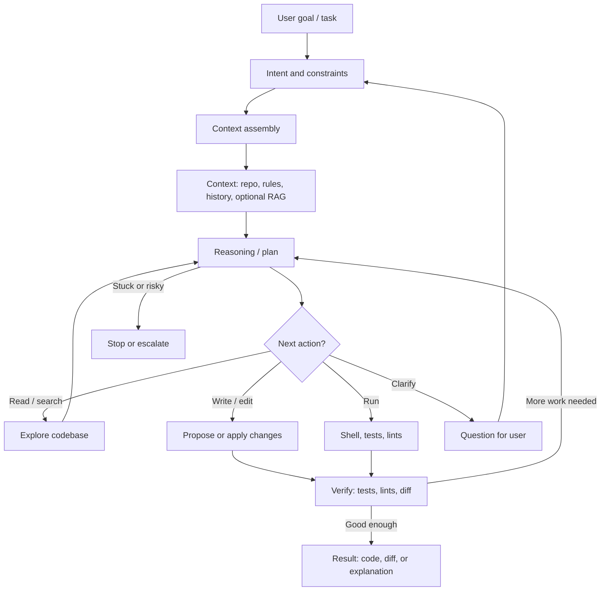

# AI Coding Agent Pipeline (Logic)

**Description:**  
An AI coding agent loops between gathering context, planning, taking actions (read, search, edit, run), and verifying outcomes until the task is done or the agent stops for safety or clarification.

**Flow:** Task → context → plan → (tools + edits + checks) → iterate until verified output or handoff.
