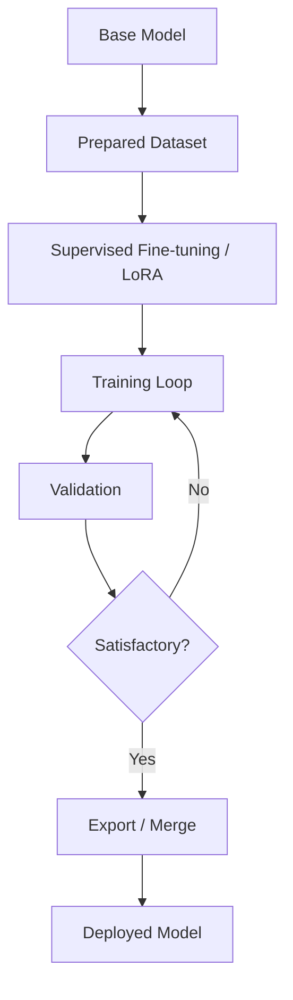

# LLM Fine-tuning Pipeline

**Description:**  
Fine-tuning adapts a pretrained LLM to a task or domain using a labeled dataset; methods like LoRA train only small adapter weights for efficiency.

**Flow:** Base model + dataset → SFT/LoRA → train → validate → export → deploy.
