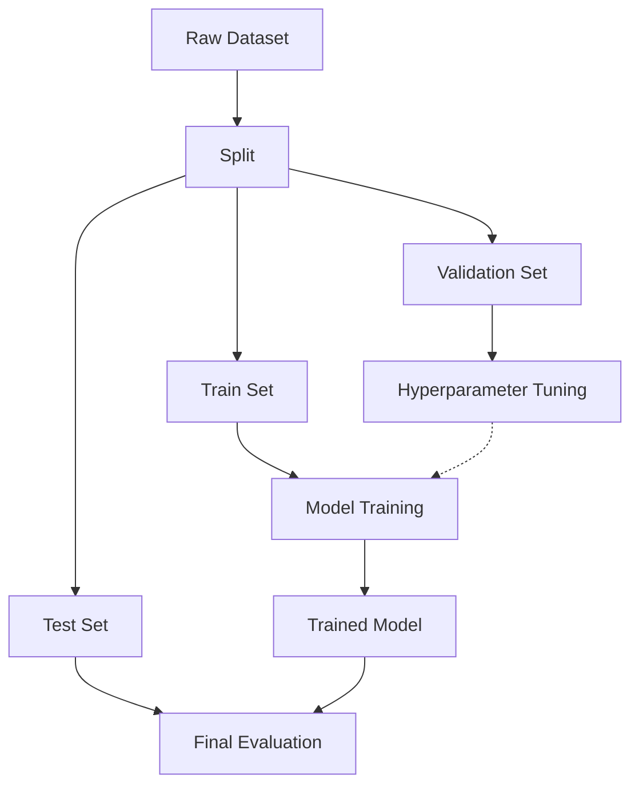

# ML Data Split: Train, Validation, Test

**Description:**  
Split data into train (fit model), validation (tune hyperparameters, early stopping), and test (unseen holdout for final metrics). Never tune on test.

**Flow:** Raw data → split → train/val/test → train on train set, tune on validation, report on test set.
