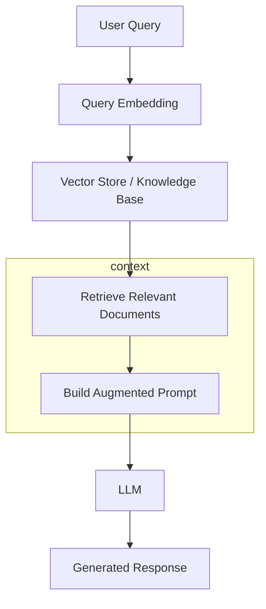

# RAG: Retrieval Augmented Generation

**Description:**  
RAG improves LLM answers by retrieving relevant documents and adding them to the prompt, so the model can cite sources and reduce hallucination.

**Flow:**  
Query → Embed → Retrieve → Augment prompt → LLM → Response
