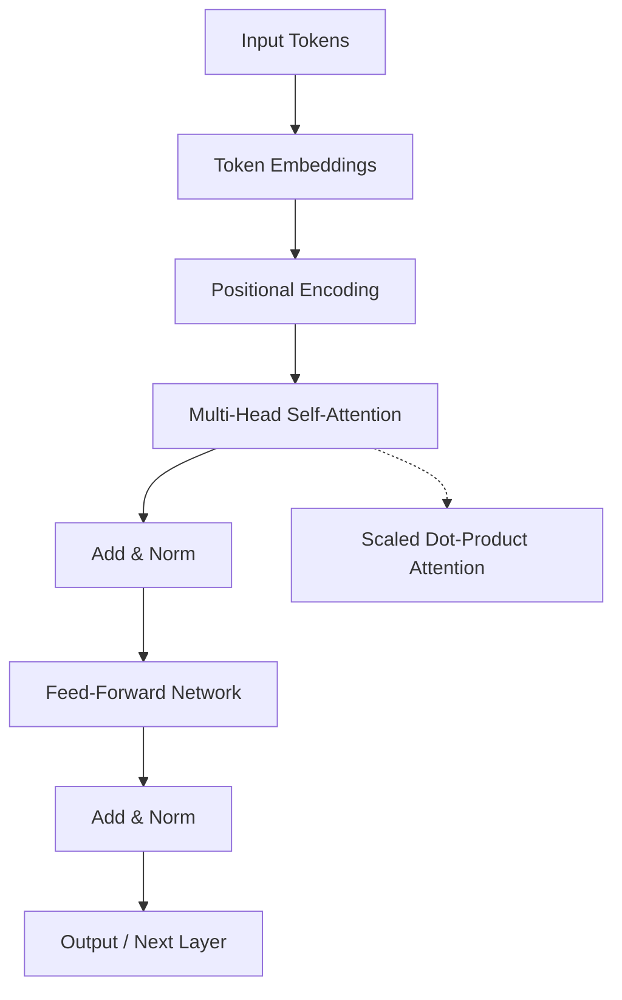

# Transformer: Attention Overview

**Description:**  
Transformers process sequences in parallel using self-attention to weigh relationships between all tokens, then apply a feed-forward layer per position.

**Key ideas:** No recurrence; attention over full sequence; stack of encoder/decoder blocks.
